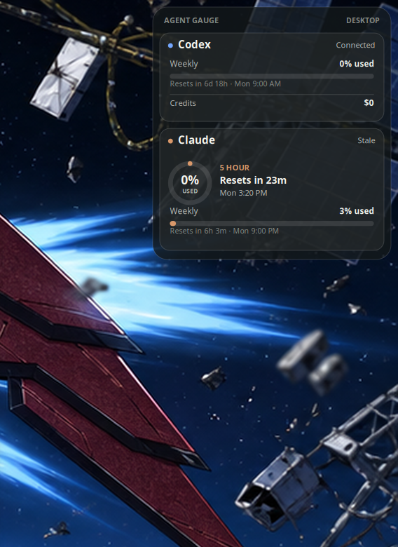
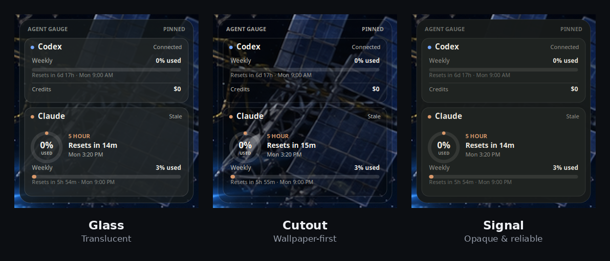
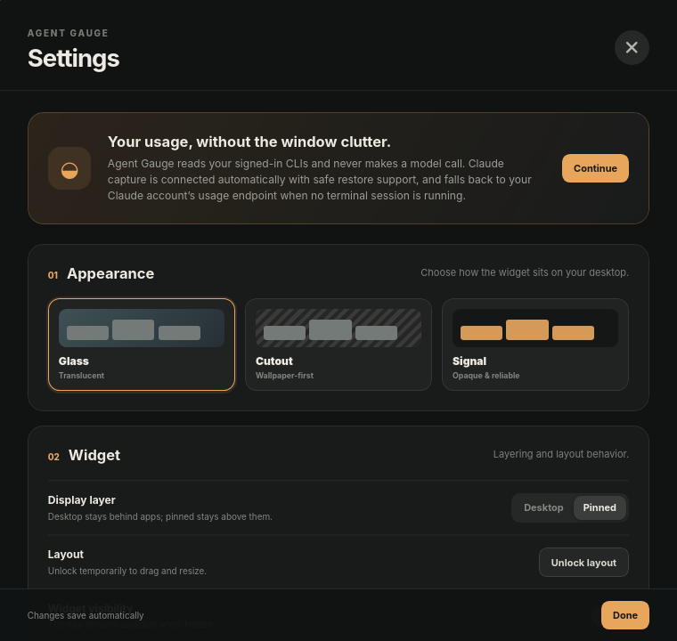
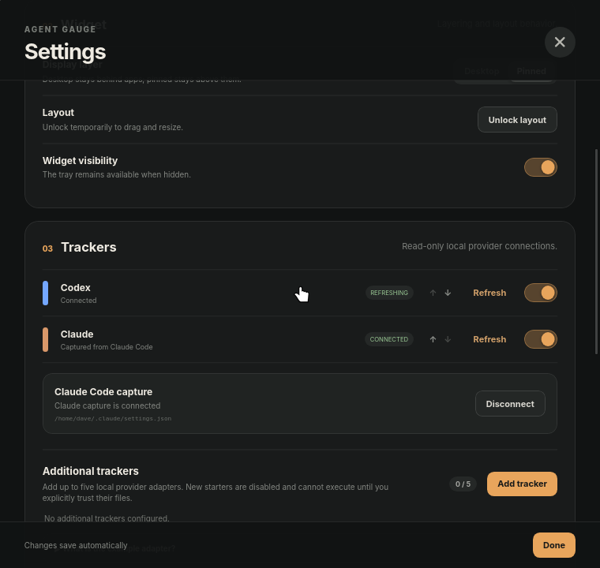

# Agent Gauge

**A small, local desktop widget for seeing your AI-agent subscription usage at a glance.**

[](https://github.com/denelson1-dot/agent-gauge/actions/workflows/ci.yml)
[](https://github.com/denelson1-dot/agent-gauge/releases/latest)
[](https://github.com/denelson1-dot/agent-gauge/releases)
[](LICENSE)
[](#supported-platforms)

<p align="center">
  
</p>

Agent Gauge runs on Linux and Windows. It reads the local Codex CLI, a reversible Claude Code status-line feed, and — when no terminal session is feeding that feed — Claude's own usage endpoint, using the sign-in Claude Code already holds.

It does **not** scrape provider websites, make model calls, store or transmit your credentials anywhere but back to the provider that issued them, send telemetry, or run a hosted service. Reading your usage does not consume it.

## Screenshots

<p align="center">
  
</p>

Three themes, chosen to suit the wallpaper underneath: **Glass** is translucent, **Cutout** lets the wallpaper dominate, and **Signal** stays opaque and readable over anything.

<p align="center">
  
</p>
<p align="center">
  
</p>

Everything is controlled from one settings window: theme, whether the widget sits on the desktop layer or above your apps, which trackers are shown and in what order, the Claude Code capture connection, and refresh behaviour.

## Supported platforms

| | Linux | Windows |
|---|---|---|
| Tested on | Linux Mint 22.3, Cinnamon, X11 | Windows 10 (1809+) and 11, x86-64 |
| Widget drawing | GTK/Cairo, drawn natively | WebView2 |
| Desktop mode | true desktop layer (`_NET_WM_STATE_BELOW`) | desktop layer via Explorer's `WorkerW`, falling back to bottom-of-z-order |
| Start at login | XDG autostart entry | per-user `Run` registry value |

Both platforms show the same readings, in the same words. Everything the widget displays — percentages, countdowns, statuses, ordering — is decided once in `src-tauri/src/render.rs` and handed to whichever painter the platform uses, so the two cannot drift apart.

## Install

Download the installer for your platform from the [**latest release**](https://github.com/denelson1-dot/agent-gauge/releases/latest).

| Platform | Download | Notes |
|---|---|---|
| Linux (Debian/Ubuntu/Mint) | `Agent.Gauge_<version>_amd64.deb` | Recommended |
| Linux (any distribution) | `Agent.Gauge_<version>_amd64.AppImage` | No installation; `chmod +x` and run |
| Windows | `Agent.Gauge_<version>_x64_en-US.msi` | Recommended |
| Windows | `Agent.Gauge_<version>_x64-setup.exe` | NSIS installer |

You do not need Rust, Node.js, a compiler, or any `-dev` packages to *use* Agent Gauge. Those are only for building from source.

### Linux

Open the downloaded `.deb` with Software Manager and choose **Install** — or from a terminal:

```bash
sudo apt install ./Agent.Gauge_0.3.1_amd64.deb
```

That is the complete application package. Your package installer will resolve the normal GTK/WebKit runtime libraries if they are not already present.

After installation, launch **Agent Gauge** from your application menu.

To run the AppImage instead:

```bash
chmod +x Agent.Gauge_0.3.1_amd64.AppImage
./Agent.Gauge_0.3.1_amd64.AppImage
```

### Windows

Run the `.msi` or the NSIS `-setup.exe`. It installs for the current user and needs no administrator rights.

If Microsoft Edge WebView2 is missing, the installer fetches it. It is already present on up-to-date Windows 11 and on most Windows 10 machines.

Installers are unsigned, so SmartScreen will warn on first run; choose **More info → Run anyway**. Signing them requires a code-signing certificate, which this project does not have.

The first run opens Settings on both platforms; the widget itself is controlled from the Agent Gauge tray icon.

## What ships

- A transparent, frameless widget with Desktop and Pinned layers.
- A locked, fully click-through mode plus tray-controlled unlock, drag, and resize.
- Glass, Cutout, and Signal themes.
- Read-only Codex usage via `codex app-server`.
- Automatic, reversible Claude Code status-line capture on first launch.
- Provider ordering, enable/disable controls, manual refresh, saved geometry, and start-at-login.
- Versioned custom-adapter manifests and snapshots with hash-bound trust, timeouts, and output limits.
- A clearly disabled example adapter documenting the supported contract, plus creation of up to five named local adapter starters.

Unknown values stay unknown. In particular, Agent Gauge never substitutes a zero balance or reset time when a provider did not report one.

Once a usage window passes the reset time the provider itself reported, that window is shown as empty and its next reset as unknown. The expired percent describes a window that has ended, so it is not carried forward while a provider is quiet.

## Where Agent Gauge keeps its files

| | Linux | Windows |
|---|---|---|
| Settings, adapters, window state | `~/.config/agent-gauge` | `%APPDATA%\agent-gauge` |
| Cached readings | `~/.cache/agent-gauge` | `%LOCALAPPDATA%\agent-gauge\cache` |
| Instance lock | `~/.local/state/agent-gauge` | `%LOCALAPPDATA%\agent-gauge\state` |
| Claude Code settings it edits | `~/.claude/settings.json` | `%USERPROFILE%\.claude\settings.json` |

The Linux paths honour `XDG_CONFIG_HOME`, `XDG_CACHE_HOME`, and `XDG_STATE_HOME` when set. Claude Code's own settings live under the home directory on both platforms, which is why that row does not follow the others.

## Quick QA

The end-user test pass is in [docs/qa.md](docs/qa.md). It only assumes the application has been installed; it does not ask you to set up a development environment.

## Claude capture and removal

On first launch, Agent Gauge points Claude Code's status-line command at itself. If another command is already configured, Agent Gauge preserves it and runs it afterwards, forwarding its output, when its shape is safe to do so. **Disconnect** restores the prior value and prevents automatic reconnection; **Connect Claude** can enable it again. If that setting changes after connection, Agent Gauge reports a conflict and leaves the live setting untouched.

There is no interpreter to install. Earlier versions generated a Python dispatcher script; an existing installation is migrated to the current mechanism automatically on first launch, and the old script is removed. A status line you have since changed yourself is never touched.

### When the status line cannot report

A status line belongs to Claude Code's terminal interface. The Claude Code desktop app draws its own interface and never renders one, so it never runs the capture command — working there used to leave the Claude gauge empty with nothing in your setup to correct.

When a capture is more than two minutes old, Agent Gauge reads the same usage endpoint Claude Code itself polls, authenticating with the sign-in already stored in `~/.claude/.credentials.json`. This is the only request Agent Gauge makes, it goes to Anthropic and nowhere else, and it carries nothing but that token.

That endpoint is asked at most **once every 15 minutes — four requests an hour, and only while no terminal session is running**. Refreshes in between are answered from the last reading, shown with the time it was actually taken. The interval is measured from the last attempt rather than the last success, so a rate-limited or rejected request is not retried any faster than a working one; the numbers stay on screen with a note saying why they have stopped moving. The widget's refresh interval controls how often the display is brought up to date, not how often a request is made, so turning it down to a minute does not turn the request rate up. Reading your usage does not consume it: this is a metering endpoint, not an inference call, and it does not touch the five-hour or weekly windows it reports.

Your credentials are read, never written. Refreshing an expired sign-in is Claude Code's job, not Agent Gauge's: attempting it here could invalidate the token Claude Code is holding and sign you out of your own editor. If the sign-in has expired, the gauge says so and opening Claude Code once repairs it.

While you are working in a terminal, the status-line capture answers on its own and no request is made.

Disconnect Claude before uninstalling if capture is enabled. Then remove Agent Gauge normally — through Software Manager on Linux, or Installed apps on Windows. The directories in the table above can be deleted afterwards if you also want to reset all preferences and cached readings.

## Custom adapters

Adapter manifests live in the adapters directory under the configuration path in the table above. Settings can create up to five disabled starter folders for additional providers. These are local executable integrations that must be implemented against a provider's read-only interface; adding one does not create a provider account or contact a service. See the bundled JSON Schemas in `schemas/adapter-manifest-v1.schema.json` and `schemas/adapter-snapshot-v1.schema.json`. Agent Gauge never executes a new or changed adapter until you explicitly trust its current manifest and executable hashes.

A generated starter is a Python script on Linux and a PowerShell script on Windows, so it runs without installing anything. An adapter may be any program that prints the documented JSON to stdout.

Windows dispatches on file extension and has no `#!` line or execute bit, so a script there must say what runs it. That is the manifest's optional `interpreter` field — the program plus any fixed arguments it needs, with the adapter's own path appended after them:

```json
{
  "command": "./read-usage.ps1",
  "interpreter": ["powershell", "-NoProfile", "-ExecutionPolicy", "Bypass", "-File"]
}
```

Omit it on Linux, where a `#!` line and the execute bit are enough. Adapters written before this field existed keep working unchanged. Trust still covers the manifest and the executable together, so naming an interpreter cannot change what runs without invalidating trust first.

## Development

The commands below are for contributors building from source, not for installing the application:

```bash
npm ci
npm run check
cargo fmt --manifest-path src-tauri/Cargo.toml --check
cargo clippy --manifest-path src-tauri/Cargo.toml --all-targets --locked -- -D warnings
cargo test --manifest-path src-tauri/Cargo.toml --all-targets --locked
npm run tauri dev
```

Source builds require the Rust toolchain, Node.js, and Tauri's platform development libraries. The packaged application does not. On Debian/Ubuntu:

```bash
sudo apt install libwebkit2gtk-4.1-dev libgtk-3-dev libayatana-appindicator3-dev \
                 librsvg2-dev libxdo-dev libssl-dev patchelf
```

### Working on both platforms from one

Most development happens on Linux, so the Windows build is kept honest two ways.

`./scripts/check-windows.sh` typechecks the Windows build from a Linux checkout. It works because `gtk` is declared only under `[target.'cfg(target_os = "linux")'.dependencies]`, so a Windows-target check never needs the GTK packages, and `cargo check` does not link, so no MSVC toolchain is required:

```bash
rustup target add x86_64-pc-windows-gnu
sudo apt install binutils-mingw-w64-x86-64
./scripts/check-windows.sh
```

The CI matrix in `.github/workflows/ci.yml` is the authority. It compiles, lints, and tests for real on both `ubuntu-22.04` and `windows-latest`, so platform-specific breakage surfaces on every push rather than on whichever machine happens to boot next. Some tests are deliberately written to be platform-agnostic for this reason — the shell-quoting rules and the `PATH`/`PATHEXT` search are exercised on both targets, and the generated adapter scaffolds are executed by their real interpreter, which means the PowerShell templates are run by the Windows runner.

Releases are built by `.github/workflows/release.yml` on a `v*` tag: `.deb` and AppImage on Linux, MSI and NSIS on Windows, attached to a draft release.

Anything platform-specific lives under `src-tauri/src/platform/`, organised by topic so both implementations of a contract sit in one file. That adjacency is deliberate — it is much harder to change one platform's behaviour without noticing the other's when they share a screen.

The historical Cinnamon/X11 feasibility evidence is retained in [docs/phase-0-cinnamon-smoke.md](docs/phase-0-cinnamon-smoke.md).

## License

MIT
